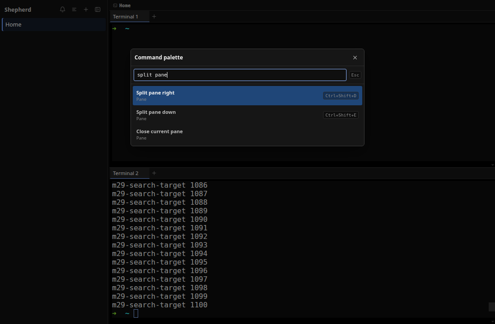
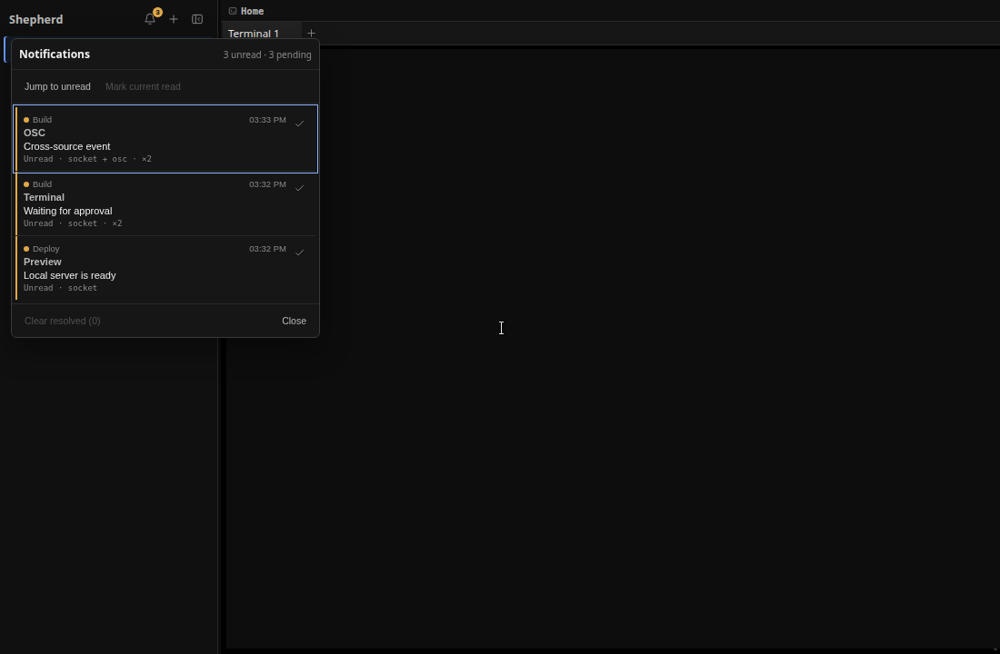
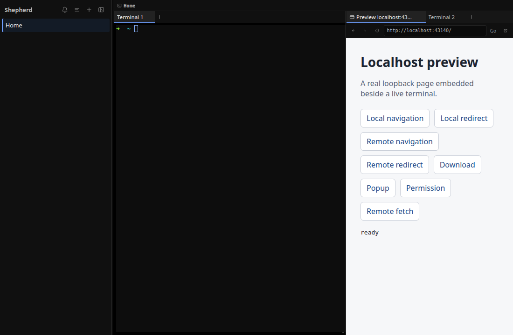

# Shepherd

> **Your coding agents. One command center.**

Shepherd is an open-source, AI-native graphical terminal multiplexer for Linux.
It combines real shells, tabs, and split panes with live project context,
automatic coding-agent discovery, semantic agent status, notifications, Git
worktree workflows, and a Unix-socket automation API.

In short: Shepherd helps you run several coding agents without losing track of
what is happening where.



> [!IMPORTANT]
> Shepherd is in early development. The core terminal, workspace, agent,
> notification, preview, and automation systems are implemented, but interfaces
> and protocols may still change before a stable release.

## Why Shepherd?

AI coding changes the developer's job. Instead of watching one terminal, you may
have several agents working across different projects, branches, and tasks.
Traditional terminal multiplexers can arrange those sessions, but they cannot
tell you which agent is testing, finished, blocked, or waiting for approval.

Shepherd turns that collection of terminals into an understandable workspace:

- **Workspaces keep projects separate.** Each sidebar row follows its live
  project directory and Git branch.
- **Tabs and splits organize real shells.** Every terminal is backed by a real
  PTY, so interactive programs behave as expected.
- **Agents become visible.** Shepherd discovers supported terminal agents and
  groups them as _Needs you_, _Working_, _Waiting_, _Finished_, or _Quiet_.
- **Attention is routed, not demanded.** Notifications and unread state show
  where intervention is required; selecting an agent jumps to its exact
  terminal.
- **Automation is built in.** The `shepherd` CLI and socket API can create
  workspaces, split panes, send input, publish status, inspect agents, and stream
  lifecycle updates.
- **Parallel work stays isolated.** A Git branch can be opened as a dedicated
  worktree-backed workspace.
- **Local apps stay beside the terminal.** Shepherd discovers ports opened by
  workspace processes and can show an explicitly selected localhost app in a
  constrained preview surface.

## More Than a Terminal Multiplexer

| A traditional terminal multiplexer | Shepherd adds                                                             |
| ---------------------------------- | ------------------------------------------------------------------------- |
| Sessions, tabs, and split panes    | Named project workspaces with live Git context                            |
| A grid of terminal output          | A sidebar that explains what each coding agent is doing                   |
| Manual checking                    | Semantic status, unread state, attention rings, and desktop notifications |
| Terminal navigation                | Jump-to-agent navigation targeting the exact pane and tab                 |
| Shell scripting                    | A validated Unix-socket API and the `shepherd` CLI                        |
| Parallel shells in one checkout    | Git worktree creation for branch-isolated tasks                           |

Shepherd is not an AI model, chatbot, or full IDE. It is the terminal-first
workspace around tools such as Codex, Claude Code, OpenCode, and other
command-line agents.

## What Works Today

- Real interactive shells powered by `node-pty`
- GPU-accelerated terminal rendering with xterm.js and WebGL fallback
- Multiple named workspaces
- Per-pane terminal tabs and draggable horizontal or vertical splits
- Live project name, working directory, Git branch, pull-request, and owned-port
  context
- Automatic Linux process discovery for recognized terminal agents
- Optional structured lifecycle integrations for richer agent state
- Agent grouping, elapsed state, attention indicators, and exact-terminal focus
- Bounded agent inspection, filtered snapshots, waits, and live subscriptions
- A bounded notification center with unread navigation, resolution, and
  workspace targeting
- Status, log, usage, and notification reporting over the socket API
- Git worktree workspace creation
- Active-workspace session restoration, including cwd, tabs, panes, and layout
- Safe Ctrl/Meta-click opening for HTTP(S), OSC 8, and existing local-file links
- Terminal search, a typed command palette, contextual shortcut help, and
  terminal settings
- A constrained localhost preview that blocks remote navigation, popups,
  downloads, and permission requests
- Chrome colors derived from the active terminal palette, with neutral default
  interaction states
- AppImage and Debian package targets
- Compatibility aliases for earlier `cmux` scripts during the migration window

## Product Tour

### Terminal utilities

Search terminal scrollback, discover available actions through the keyboard-first
command palette, and keep shortcuts and settings close without turning the shell
into an IDE.


### Attention without terminal checking

Socket and OSC notifications feed a bounded inbox. Shepherd can jump from an
unread item back to the workspace and exact terminal that produced it.



### Localhost preview

Open a detected loopback server beside its terminal. Preview navigation remains
restricted to localhost and uses a dedicated Electron session boundary.



## Install

Download the latest Linux artifact from the
[GitHub releases page](https://github.com/ANIRUDH-SJ/shepherd/releases).

### AppImage

```bash
chmod +x Shepherd-*.AppImage
./Shepherd-*.AppImage
```

### Debian or Ubuntu

```bash
sudo apt install ./Shepherd_*_amd64.deb
shepherd
```

You can also launch **Shepherd** from the desktop application menu after
installing the Debian package.

### Build from source

Clone the repository on Linux with Node.js and npm available, then run:

```bash
npm install
npm run dev
```

`npm install` installs the native `node-pty` dependency. If your platform cannot
use its prebuilt binary, the installation may require the usual native Node.js
build toolchain.

## Quick Start

1. Open Shepherd. The first workspace starts in a real shell.
2. Open your project directory and launch a terminal-based coding agent as you
   normally would.
3. Use `Ctrl+Shift+N` for another workspace, `Ctrl+Shift+T` for a tab, or the
   split shortcuts to run work side by side.
4. Press `Ctrl+Shift+P` to discover workspace, pane, attention, and view actions.
5. Watch the sidebar for live project, Git, port, and agent state.
6. Select an agent or notification when it needs attention to return to its exact
   terminal.

Basic agent presence is automatic for recognized processes. For richer semantic
events—such as _testing_, _waiting for approval_, or _done_—install the optional
provider integrations from inside a Shepherd terminal:

```bash
shepherd integrations setup
```

You can target one provider with `shepherd integrations setup codex`,
`shepherd integrations setup claude`, or `shepherd integrations setup opencode`.
Run `shepherd integrations setup` again after upgrades when you want Shepherd to
refresh its managed integration blocks. Codex users must also review and trust
new lifecycle hooks in Codex before they become active.

## Keyboard and Mouse

| Shortcut                   | Action                                      |
| -------------------------- | ------------------------------------------- |
| `Ctrl+Shift+D`             | Split the active pane to the right          |
| `Ctrl+Shift+E`             | Split the active pane downward              |
| `Ctrl+Shift+T`             | Open a terminal tab in the active pane      |
| `Ctrl+Shift+N`             | Create a workspace                          |
| `Ctrl+Shift+W`             | Close the active surface or pane            |
| `Ctrl+Shift+B`             | Toggle the sidebar                          |
| `Ctrl+Shift+F`             | Find in the active terminal                 |
| `Ctrl+Shift+P`             | Open the command palette                    |
| `Ctrl+Shift+U`             | Jump to the latest unread notification      |
| `Ctrl+Shift+M`             | Mark the current workspace read             |
| `Ctrl+Shift+=` / `-` / `0` | Zoom terminal in / out / reset              |
| `Ctrl+Shift+,`             | Open terminal settings                      |
| `Ctrl+Shift+?`             | Show contextual shortcut help               |
| `F2` on a workspace        | Rename the workspace                        |
| `Ctrl`/`Meta` + click      | Open a validated terminal URL or local file |

When a terminal tab has keyboard focus, Left/Right wraps across tabs, Home/End
selects the first or last tab, and Delete closes the focused tab when another
surface remains.

Workspaces can also be renamed from their context menu, by double-clicking the
name, or with the pencil action. Saving an empty name returns to the live project
name.

## Agent-Aware Automation

Every Shepherd terminal receives these environment variables:

- `SHEPHERD_WORKSPACE_ID` — the workspace containing the terminal
- `SHEPHERD_SURFACE_ID` — the terminal surface itself
- `SHEPHERD_SOCKET_PATH` — the active Unix socket, normally
  `/tmp/shepherd.sock`

It also receives the `shepherd` command on its `PATH`, so commands automatically
target the correct workspace when run inside a pane.

### Publish status and attention

```bash
shepherd set-status "running tests"
shepherd notify --title "Claude" --body "needs your attention"
shepherd log "integration suite started"
shepherd report-usage --input-tokens 1200 --output-tokens 340 --accuracy exact
```

### Control the workspace

```bash
shepherd list-workspaces
shepherd new-workspace --name api
shepherd new-split right
shepherd send-text "npm test"
shepherd send-key enter
shepherd rename-workspace --workspace api --name backend
```

### Create an isolated worktree workspace

```bash
shepherd new-worktree \
  --repo /absolute/path/to/repo \
  --path /absolute/path/to/worktree \
  --new-branch feat/example \
  --name example
```

### Observe and control agents

```bash
shepherd list-agents --state working,blocked
shepherd agent-snapshot --provider codex,claude
shepherd watch-agents
shepherd focus-agent <agent-id>
shepherd inspect-agent <agent-id> --lines 80
shepherd wait-agent <agent-id> --state done --timeout-ms 600000
```

Use `shepherd --help` for the full command and filter reference. The deprecated
`cmux` launcher and `CMUX_*` environment names remain available temporarily for
existing integrations; new scripts should use `shepherd` and `SHEPHERD_*`.

## How It Works

```text
terminal input
  → secure preload bridge
  → Electron main process
  → node-pty and the real shell
  → bounded output stream
  → xterm.js renderer

agent process or provider hook
  → automatic discovery or `shepherd` CLI
  → Unix-socket protocol
  → validated workspace and agent state
  → React sidebar, notifications, and exact-terminal navigation

workspace-owned local server
  → bounded Linux process and socket discovery
  → explicit localhost selection
  → isolated, loopback-only preview surface
```

The Electron main process owns privileged operations: PTYs, Linux process
inspection, persistence, worktrees, external-link validation, the socket server,
and OS notifications. The renderer owns presentation and pure workspace/layout
state. A restricted preload bridge exposes only the typed IPC surface required
by the UI.

## Technology

- **Electron** — Linux desktop application and privileged main process
- **React + TypeScript** — workspace, sidebar, tab, and pane UI
- **xterm.js** — terminal emulation and WebGL rendering
- **node-pty** — real interactive shell processes
- **electron-vite** — development and production bundling
- **electron-builder** — AppImage and `.deb` packaging

## Development

```bash
npm install          # install dependencies
npm run dev          # launch with renderer hot reload
npm test             # run all executable TypeScript and CLI tests
npm run lint         # check JavaScript, TypeScript, and TSX
npm run typecheck    # validate main/preload and renderer projects
npm run build        # typecheck and build production bundles
npm run dist         # build AppImage and .deb artifacts in release/
```

Before submitting a pull request, run:

```bash
npm test
npm run lint
npm run typecheck
npm run build
```

Do not commit generated output from `out/` or `release/`. See
[AGENTS.md](AGENTS.md) for the repository's feature-delivery, testing,
documentation, commit, and pull-request conventions.

## Repository Guide

```text
src/main/          Electron main process: PTYs, socket API, agents, persistence
src/preload/       restricted IPC bridge exposed to the renderer
src/renderer/src/  React UI, state reducers, layout tree, and terminal views
src/shared/        shared IPC and protocol contracts
bin/               `shepherd` CLI and temporary compatibility launcher
benchmarks/        terminal performance and lifecycle harnesses
bug-fixes/         public write-ups for resolved foundational defects
build/             packaging assets
docs/images/       repository screenshots
```

Useful starting points:

- [PRODUCT.md](PRODUCT.md) — product definition, positioning, and pitch
- [AGENTS.md](AGENTS.md) — repository workflow and contribution conventions
- [LEARNING.md](LEARNING.md) — the public Electron learning path
- [REFRESHER.md](REFRESHER.md) — React, Node.js, and CSS refresher
- [benchmarks/README.md](benchmarks/README.md) — performance methodology and usage
- [bug-fixes/README.md](bug-fixes/README.md) — resolved bug write-ups

## Project Status

The core runtime milestones are complete: real terminals, workspaces, tabs,
splits, socket automation, semantic and automatic agent discovery, worktree
creation, live Git context, session restore, bounded terminal flow, terminal
lifecycle ownership, safe clickable links, a notification center, terminal
utilities, pull-request and port context, and localhost preview.

Current work is focused on product polish, packaging/distribution, and expanded
rendering, interaction, scalability, and agent-overhead benchmarks.

## Origin and License

Shepherd began because [cmux](https://cmux.com) did not have a Linux version. It
now has an independent product identity and is evolving beyond parity while
retaining attribution to that original inspiration.

Shepherd is an independent implementation and is not affiliated with cmux or
derived from its source.

Released under the [MIT License](LICENSE). Copyright © 2026 Anirudh S J.
