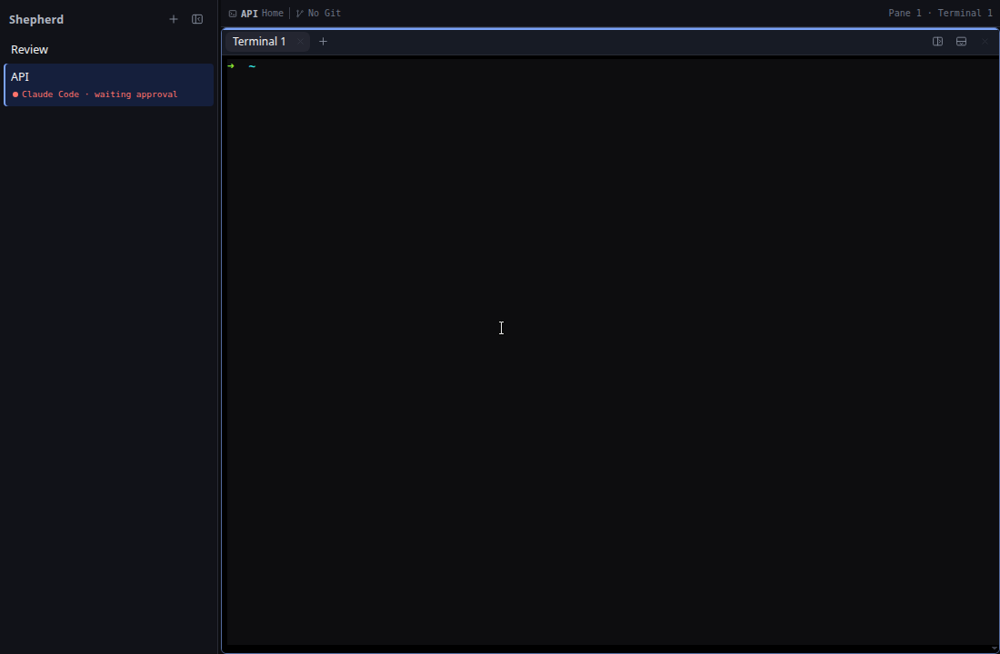

# M24 — Minimal Workspace Sidebar

## Goal

This milestone removes the dashboard-like furniture around workspace navigation.
The sidebar is now a compact, flat list: a workspace always appears, while agent,
branch, usage, and status details appear only when they contain useful information.

The change is intentionally renderer-only. Agent discovery, lifecycle reports,
workspace ownership, socket commands, reducers, and exact terminal focus keep the
same contracts.

## What changed

```text
before                                  after
──────────────────────────────          ──────────────────────────────
Shepherd toolbar                         Shepherd toolbar
workspace cards                          flat workspace rows
permanent Agents section                 agents under owning workspace
Agents 0 empty-state card                nothing when no agents exist
permanent shortcut legend                shortcuts remain available, not listed
placeholder "No Git repository"          unavailable metadata is omitted
```

The result gives the terminal most of the window and keeps the sidebar focused on
navigation and live exceptions.

## `Sidebar.tsx`: one ownership hierarchy

`src/renderer/src/components/Sidebar.tsx` now builds a `Map` from workspace id to
agent records in one pass:

```text
AgentRecord.workspaceId
  → agentsByWorkspace.get(workspace.id)
  → urgency sort
  → contextual buttons inside that workspace row
```

The map avoids filtering the complete agent array once for every workspace. It is
derived during render because it is cheap, synchronous presentation state; there
is no second React state source to synchronize.

Each workspace row has three possible layers:

1. its primary project or custom name;
2. real secondary metadata such as project context, Git branch, or usage;
3. zero or more agent buttons owned by that workspace.

When an agent exists, the workspace's generic status subtitle is suppressed so the
same activity is not stated twice. When no agent exists, a real socket-provided
status can still appear. A fresh workspace therefore renders as one compact line.

The global `AgentList.tsx` component was deleted. Its urgency projection was useful
for a dashboard, but it duplicated the same agents outside their workspace and
reserved a large block even when nothing was running.

## Contextual agent navigation remains exact

Moving agent rows did not weaken their behavior. Each `.ws-agent` is still a real
button. Activating it:

1. dispatches `focusAgent` with the stable agent id;
2. the reducer selects the owning workspace, pane, and terminal surface;
3. a `focusSurface` renderer event moves keyboard focus to that exact terminal.

`workspaceAgentLabel()` produces compact visible text such as
`Claude Code · waiting approval`. `workspaceAgentAriaLabel()` adds the action,
workspace, and optional detail, for example
`Focus Claude Code, waiting approval, API, Needs approval`.

`sortAgentsForSidebar()` still orders records by urgency and recency within each
workspace, so actionable agents remain the first contextual entries.

## Useful metadata only

`src/renderer/src/sidebarView.ts` keeps the existing identity rule:

```text
custom name → custom name first, project as context
no name     → live project first, position as fallback context
```

The new `workspaceProjectContext()` helper decides whether the secondary project
label adds information. It omits context for unnamed workspaces and suppresses the
generic `Home` label below custom names. Real repository/project names remain
available, and paths remain in titles where their precision is useful without
becoming permanent copy.

The sidebar also stops rendering a `No Git repository` placeholder. A branch row
exists only when `gitBranch` exists; usage exists only after a report; agent rows
exist only while records exist.

## CSS hierarchy

`src/renderer/src/App.css` changes the sidebar from cards to a compact list:

- smaller outer and toolbar padding;
- neutral product label instead of an accent headline;
- 24-pixel toolbar controls;
- borderless workspace rows with a small radius;
- restrained active background and a two-pixel ownership edge;
- compact metadata and contextual agent typography;
- static semantic agent dots rather than repeating agent pulses;
- visible hover and keyboard focus states;
- intentional metadata omission below the 210-pixel container threshold;
- reduced-motion protection for the remaining workspace attention animation.

The deleted Agents section, empty-state, grouping, and shortcut selectors were
removed instead of being left as dead CSS.

## Tests and live proof

Pure tests cover compact agent labels, complete accessible labels, urgency sorting,
useful project context, generic `Home` omission, and unnamed workspace behavior.
The app reducer suite confirms that `focusAgent` still selects the workspace, pane,
and terminal surface and acknowledges its markers.

The branch was also launched in an isolated Electron display with private XDG and
socket paths. The live checks covered a fresh launch, multiple custom workspaces,
working and approval-blocked agents, an unread/attention workspace, a 190-pixel
sidebar, and emulated reduced motion. At 190 pixels every row kept its actions
inside the sidebar without horizontal overflow, and reduced motion produced no
workspace animation.



A DevTools interaction clicked a contextual Claude Code row while `Review` was
active. The active workspace changed to `API`, proving that the visible button is
connected to exact agent navigation rather than being a passive status label.

## Intentionally deferred

M24 does not restyle the stacked terminal headers, replace the blue palette, or
redesign notification rings. Those are isolated in M25, M26, and M27 so each PR
has one reviewable visual responsibility. It also does not add PR, port, palette,
settings, or preview features; those remain M28–M30.

## Checkpoint

1. Why are agents grouped into a `Map` before rendering workspace rows?
2. Which reducer action preserves exact navigation after the global list is gone?
3. Why is a missing branch better represented by no branch row than placeholder text?
4. What information does the visible agent label omit but the accessible label retain?
5. Which visual concerns are deliberately left for M25–M27?
