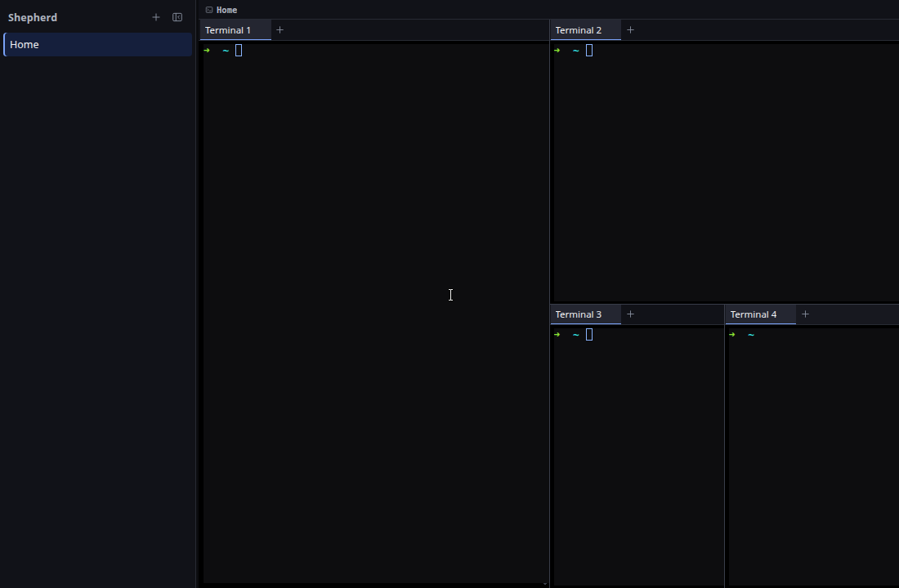

# M25 — Minimal Terminal Chrome

## Goal

M25 removes the card grid around terminal content. A workspace now has one compact
title strip followed by one compact tab row per pane. Split terminals meet at
hairline dividers instead of sitting inside rounded, permanently accented boxes.

The renderer presentation changed; layout geometry, reducer ownership, PTY
lifetime, IPC, terminal links, and socket automation did not.

## Completed hierarchy

```text
workspace title strip            24px
pane tab row                     26px
terminal content                 remaining space
```

The title strip shows the workspace identity and a Git branch only when one
exists. It no longer repeats positional project context, `No Git`, or the
permanent `Pane N · Terminal N` status. Pane and terminal counts remain available
in the strip's accessible name.

## Accessible workspace context

`terminalWorkspaceAriaLabel()` in `src/renderer/src/terminalChrome.ts` builds a
compact label such as `Home, 4 panes, 4 terminals`. `WorkspaceView.tsx` applies
that label to the workspace header while keeping only useful identity text
visible.

The helper is pure and covers singular, plural, and empty counts. Stable pane and
surface ids still drive reducers and PTYs; positional `Terminal N` labels remain
the accessible and visible fallback inside tabs until semantic titles exist.

## Flat panes and tabs

`src/renderer/src/App.css` makes pane geometry read as one continuous workspace:

- pane borders and radii are zero;
- the active pane uses a neutral tab-row surface, not an accent ring;
- split dividers render as one-pixel neutral hairlines inside larger drag targets;
- the workspace and tab rows use 24px and 26px fixed heights;
- tabs are rectangular, with transparent inactive backgrounds;
- the active tab uses one small bottom indicator;
- close buttons appear for tab hover or focus;
- pane actions rest at zero opacity and appear when their toolbar is hovered or
  the action group receives keyboard focus;
- impossible close actions remain natively disabled.

Opacity changes do not remove controls from the keyboard order. A focused split
button makes its complete action group visible, and every icon retains a title
and accessible label.

## Many-tab behavior

Minimal chrome still needs to work when a pane has many terminals. The tab list
is horizontally scrollable with its scrollbar hidden. `TabBar.tsx` keeps a ref to
the active presentation row and synchronizes it with the scroll viewport using:

```text
activeSurfaceId changes
  → active tab ref updates
  → scrollIntoView(block: nearest, inline: nearest)
```

This effect synchronizes React selection with an external DOM viewport; it does
not duplicate selection state. In a live 13-tab check, exactly one tab remained
selected and tabbable, the list scrolled to its active end, and the selected tab
was fully visible.

## Semantics and terminal lifetime

The ARIA relationship is unchanged:

```text
tablist
  → tab aria-selected aria-controls
     → tabpanel aria-labelledby
```

Arrow keys, Home, and End still use the pure roving-focus helper. Delete still
closes a terminal only when the structural capability allows it. Inactive
`TerminalHost` components stay mounted and hidden, so changing tab chrome does
not kill a PTY or discard scrollback.

Pane capture still selects the owning pane before xterm handles the pointer.
Dividers still dispatch fractional resize deltas against the unchanged layout
tree. The visual simplification therefore does not create a second focus or
geometry model.

## Verification

Focused tests covered tab navigation, DOM id agreement, accessible workspace
counts, layout splits, reducer behavior, and the semantic token boundary.

The branch ran in isolated Electron/Xvfb state with one, two, four, and eight
panes. The four-pane state measured a 24px title strip and 26px tab rows, zero
pane border and radius, four selected tabs across four independent tablists, and
no visible `Pane N · Terminal N` copy. Pane actions measured opacity `0` at rest
and `1` after a keyboard focus transition.



The eight-pane state confirmed that deeply nested splits retain continuous
hairline boundaries and intentional title truncation. The 13-tab state confirmed
one selected tab, one roving tab stop, and automatic active-tab visibility.

## Intentionally deferred

M25 does not replace the blue palette or redefine semantic colors. M26 owns that
token change. It also leaves current attention animation behavior for M27, where
notification storage and navigation will provide the behavioral context needed
to change rings safely.

## Checkpoint

1. Why does the visible workspace strip omit pane numbers while its ARIA label keeps counts?
2. Why are pane drag targets wider than their visible one-pixel boundaries?
3. How can an opacity-zero action remain keyboard accessible?
4. Why is `scrollIntoView` an effect rather than reducer state?
5. Which runtime contracts remain unchanged by flat pane styling?
