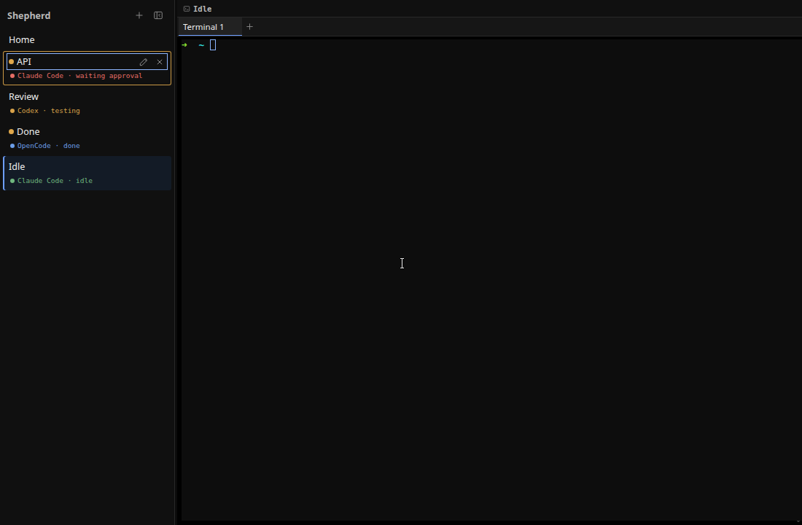

# M26 — Neutral Terminal-First Theme

## Goal

M26 removes the blue-purple dashboard palette from Shepherd's permanent shell.
The canvas, sidebar, tabs, controls, and dividers now use neutral near-black and
charcoal roles. Color is reserved for a selected destination, keyboard focus, or
a semantic state that changes what the user should do.

This milestone changes presentation boundaries only. Workspace reducers, layout
geometry, agent reports, PTY ownership, terminal links, socket automation, and
session persistence retain their existing contracts.

## The token boundary

`src/renderer/src/App.css` owns the renderer's semantic design contract in
`:root`. The important groups are:

```text
neutral surfaces  canvas → sidebar → surface → hover → raised
neutral borders   border → strong border
content           primary → secondary → muted → subdued → faint
interaction       accent, selection, focus
state             attention, danger, success, info, working, Git
geometry          3px / 4px / 6px radii, spacing, popover-only shadow
```

Components ask for roles rather than literal colors. Ordinary hover consumes a
neutral surface. The selected workspace and active terminal tab consume the
accent family. A blocked agent consumes danger; working consumes amber; idle
consumes success; done consumes informational blue.

The default shell therefore has no decorative blue cards or permanent accent
rings. Its largest and highest-contrast region is still the terminal canvas.

## Semantic interaction states

M26 deliberately separates state from decoration:

- blue means selection, information, or keyboard focus;
- green means idle/ready success;
- amber means working, waiting, or attention;
- red means blocked or failed;
- gray means Git or secondary metadata;
- repeating motion belongs only to attention and disappears under
  `prefers-reduced-motion: reduce`.

Text and accessible labels carry the same meaning, so color and animation are
never the sole state signal. A shared `button:focus-visible` and
`input:focus-visible` rule keeps every native control on the accessible focus
token instead of allowing Chromium's platform-default ring to leak through.

## Terminal colors are a separate contract

`src/renderer/src/terminalTheme.ts` exports `TERMINAL_THEME`, a frozen xterm
theme object. `TerminalHost.tsx` passes it directly to the xterm constructor.

This is intentionally not derived from the shell's CSS variables:

```text
App.css semantic UI tokens ──→ React/Electron chrome
terminalTheme.ts            ──→ xterm canvas, cursor, selection
```

A later terminal-theme setting can replace the xterm object without repainting
navigation semantics. Conversely, changing a sidebar surface cannot silently
alter ANSI output, cursor visibility, or terminal selection.

## Regression coverage

`src/renderer/src/themeTokens.test.ts` reads the token boundary and component
CSS. It verifies that required roles exist and are consumed, raw colors remain
inside `:root`, every shell surface is neutral, radius geometry is restrained,
ordinary hover is neutral, semantic states own their intended roles, uppercase
navigation styling is absent, and native controls use the focus token.

The same test computes WCAG-style contrast ratios for the key foreground and
background pairs. It requires strong primary and secondary contrast, readable
muted sidebar text, and a clearly visible focus color.

`src/renderer/src/terminalTheme.test.ts` proves that the terminal theme is
frozen, complete, and independent from CSS token names. Adding the test to the
repository `npm test` chain prevents that architectural boundary from becoming
an untested convention.

## Live acceptance proof

The isolated Electron/Xvfb review covered a fresh neutral launch plus selected,
working, blocked, done, and idle agent states. Browser assertions measured:

- canvas `rgb(11, 11, 11)`, sidebar `rgb(16, 16, 16)`, and a neutral pane;
- the theme focus ring `rgb(141, 181, 255)` after keyboard navigation;
- no horizontal overflow at a 190px sidebar width;
- an impossible pane-close action that remained natively disabled at `0.18`
  opacity;
- `prefers-reduced-motion: reduce` matching with attention animation `none`;
- no uppercase transformation in the brand, status, or workspace strip; and
- 3px row radii with zero-radius terminal panes.



## Failure behavior and boundaries

An undefined CSS variable invalidates only the declaration that consumes it, so
the structural token test catches missing or unused roles before a subtle visual
fallback reaches users. Static tokens and a frozen terminal theme add no IPC,
filesystem, process, or network authority.

Future user themes must validate a bounded set of values rather than loading
arbitrary CSS. High-contrast mappings should override semantic roles, and
terminal palettes should continue through the dedicated xterm boundary.

## Checkpoint

1. Why is an ordinary workspace hover neutral while keyboard focus is blue?
2. Why does `TERMINAL_THEME` not read values from `App.css`?
3. Which assertions can a token test prove, and which still require visual review?
4. Why are semantic states represented by text as well as color?
5. What did the narrow and reduced-motion live checks protect against?
