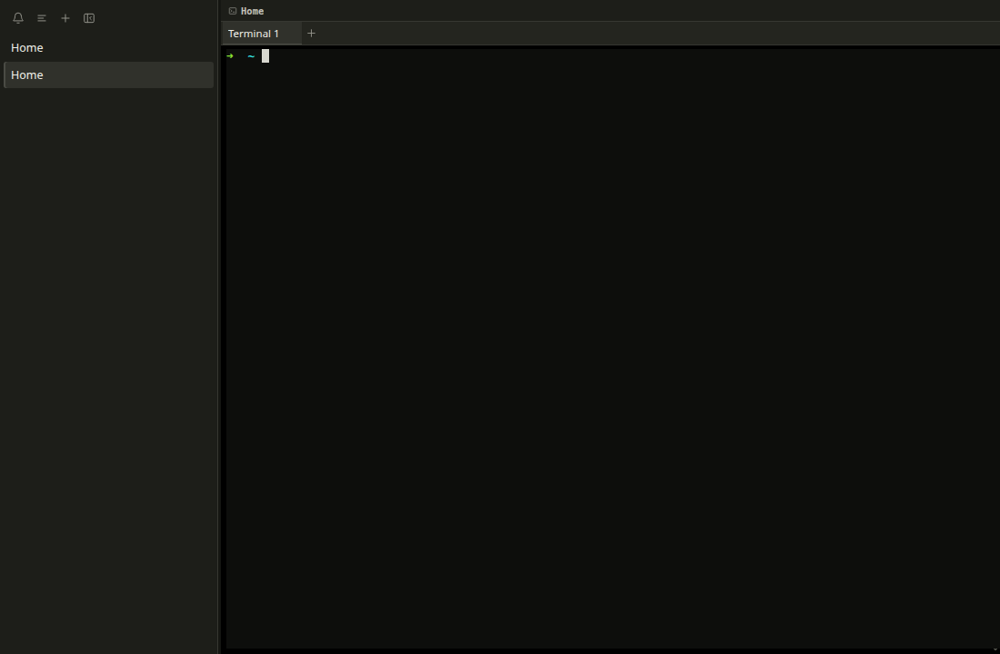

# M26 — Neutral Terminal-First Theme

## Goal

M26 removes the blue-purple dashboard palette from Shepherd's permanent shell.
The canvas, sidebar, tabs, controls, selection, and focus treatment now use a
low-chroma graphite hierarchy. Saturated color is reserved for semantic states
that change what the user should do.

This milestone changes presentation boundaries only. Workspace reducers, layout
geometry, agent reports, PTY ownership, terminal links, socket automation, and
session persistence retain their existing contracts.

## The token boundary

`src/renderer/src/App.css` owns the renderer's semantic design contract in
`:root`. The important groups are:

```text
neutral surfaces  canvas → sidebar → surface → hover → raised
neutral borders   border → strong border
content           primary → secondary → muted → subdued → faint
interaction       accent, selection, focus
state             attention, danger, success, info, working, Git
geometry          3px / 4px / 6px radii, spacing, popover-only shadow
```

Components ask for roles rather than literal colors. Ordinary hover consumes a
neutral surface. The selected workspace, active terminal tab, and keyboard focus
consume distinct graphite roles. A blocked agent consumes danger; working
consumes amber; idle consumes success; done consumes a subdued informational
role.

The default shell therefore has no decorative blue cards or permanent accent
rings. Its largest and highest-contrast region is still the terminal canvas.

## Semantic interaction states

M26 deliberately separates state from decoration:

- graphite contrast means selection or keyboard focus;
- green means idle/ready success;
- amber means working, waiting, or attention;
- red means blocked or failed;
- gray means Git or secondary metadata;
- repeating motion belongs only to attention and disappears under
  `prefers-reduced-motion: reduce`.

Text and accessible labels carry the same meaning, so color and animation are
never the sole state signal. A shared `button:focus-visible` and
`input:focus-visible` rule keeps every native control on the accessible focus
token instead of allowing Chromium's platform-default ring to leak through.

## Terminal colors are a separate contract

`src/renderer/src/terminalTheme.ts` exports `TERMINAL_THEME`, a frozen xterm
theme object. `TerminalHost.tsx` passes it directly to the xterm constructor.

This is intentionally not derived from the shell's CSS variables, even though
the default terminal cursor and selection now use matching neutral graphite:

```text
App.css semantic UI tokens ──→ React/Electron chrome
terminalTheme.ts            ──→ xterm canvas, cursor, selection
```

A later terminal-theme setting can replace the xterm object without repainting
navigation semantics. Conversely, changing a sidebar surface cannot silently
alter ANSI output, cursor visibility, or terminal selection.

## Regression coverage

`src/renderer/src/themeTokens.test.ts` reads the token boundary and component
CSS. It verifies that required roles exist and are consumed, raw colors remain
inside `:root`, every shell surface is neutral, radius geometry is restrained,
ordinary hover is neutral, semantic states own their intended roles, uppercase
navigation styling is absent, and native controls use the focus token.

The same test computes WCAG-style contrast ratios for the key foreground and
background pairs. It requires strong primary and secondary contrast, readable
muted sidebar text, and a clearly visible focus color.

`src/renderer/src/terminalTheme.test.ts` proves that the terminal theme is
frozen, complete, and independent from CSS token names. Adding the test to the
repository `npm test` chain prevents that architectural boundary from becoming
an untested convention.

## Live acceptance proof

The isolated Electron/Xvfb review covered the final post-M30 shell. Browser
assertions measured:

- canvas `rgb(21, 22, 18)`, sidebar `rgb(29, 30, 25)`, and a near-black terminal;
- active workspace and active tab surfaces at `rgb(48, 49, 43)`;
- neutral active edges at `rgb(74, 75, 68)` with no accent-colored rail;
- a neutral focus token at `rgb(228, 228, 220)`;
- no duplicate product name in the sidebar toolbar; and
- a neutral xterm cursor and selection palette.



## Post-M30 graphite correction

Later shell work exposed three residual blue treatments: the workspace selection
block, the active tab underline, and xterm's cursor/selection defaults. The
correction keeps cmux's dense, flat hierarchy while honoring Shepherd's no-blue
default:

1. `App.css` maps shell surfaces and interaction tokens to warm graphite roles.
2. Active rows and tabs use neutral surface and border contrast, not an accent.
3. `terminalTheme.ts` supplies a matching neutral xterm cursor and selection.
4. `Sidebar.tsx` removes the duplicate product label and keeps its tools aligned
   with the compact titlebar.
5. Token regressions reject chromatic surface/interaction roles and reject active
   workspace or tab rules that consume the accent token.

## Failure behavior and boundaries

An undefined CSS variable invalidates only the declaration that consumes it, so
the structural token test catches missing or unused roles before a subtle visual
fallback reaches users. Static tokens and a frozen terminal theme add no IPC,
filesystem, process, or network authority.

Future user themes must validate a bounded set of values rather than loading
arbitrary CSS. High-contrast mappings should override semantic roles, and
terminal palettes should continue through the dedicated xterm boundary.

## Checkpoint

1. Why do hover, selection, and keyboard focus use different graphite roles?
2. Why does `TERMINAL_THEME` not read values from `App.css`?
3. Which assertions can a token test prove, and which still require visual review?
4. Why are semantic states represented by text as well as color?
5. What did the narrow and reduced-motion live checks protect against?
