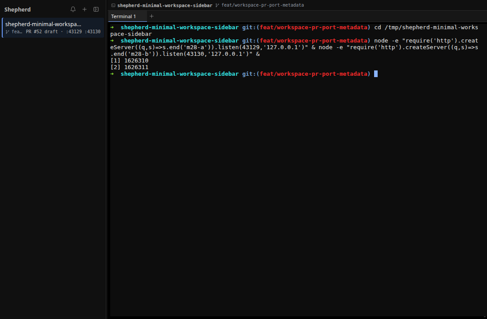

# M28 — Compact Pull-Request and Listening-Port Metadata

## Goal

M28 adds the two pieces of live workspace context that are most useful after
project and branch: the pull request associated with the current branch and the
localhost servers started from the active terminal. Both stay optional and fit in
one quiet sidebar line instead of becoming dashboard panels.

## Shared metadata contract

`src/shared/workspaceMetadata.ts` now carries:

```ts
interface WorkspacePullRequest {
  number: number
  state: 'open' | 'draft' | 'merged' | 'closed'
  url: string
}

interface WorkspaceMetadata {
  // existing surface, cwd, project, and Git fields
  pullRequest: WorkspacePullRequest | null
  ports: number[]
}
```

The runtime validator accepts only positive safe PR numbers, known states,
GitHub HTTPS URLs, and at most 16 unique ascending ports in the TCP range. The
equality helper compares every PR field and each port so unchanged scans do not
cause renderer churn.

`appReducer.ts` copies validated values only when the metadata still belongs to
the active terminal. Switching tabs or panes immediately clears the prior
surface's PR and ports while main discovers the new context. Live metadata is
intentionally excluded from session restoration because a PR may merge and a
server may exit while Shepherd is closed.

## Optional pull-request discovery

`src/main/workspaceContext.ts` runs this bounded command only for a non-detached
branch inside a Git repository:

```text
gh pr view --json number,state,isDraft,url
```

The command disables prompts, has a two-second timeout, and caps output at 16
KiB. Parsing starts from untrusted text. Malformed JSON, unexpected states,
non-GitHub URLs, missing `gh`, no remote, no matching PR, authentication failure,
and timeout all produce `null`. That makes GitHub an enhancement rather than a
startup dependency and keeps passive discovery from showing authentication
errors.

`WorkspaceMetadataDiscovery` keys the PR cache by Git root plus branch. A branch
change invalidates it immediately; otherwise it refreshes every 30 seconds. It
never invokes `gh` outside a repository or for detached HEAD.

## Process-owned listening ports

The same module reads Linux kernel state instead of parsing terminal text:

1. `/proc/net/tcp` and `/proc/net/tcp6` provide listening socket inode and port
   pairs (`0A` is TCP `LISTEN`).
2. `/proc/<pid>/stat` builds a bounded parent map.
3. `collectOwnedProcessIds()` finds at most 512 descendants of the active PTY
   shell.
4. At most 1,024 file descriptors per owned process are resolved and matched to
   `socket:[inode]` links.
5. Ports are validated, deduplicated, sorted, and capped at 16.

The shell and any socket inode it already holds are excluded. This matters in
Electron development: Chromium's debugging socket can be inherited by the PTY
shell and then by child servers. Excluding inherited descriptors prevents that
application-owned listener from being mislabeled as workspace context while
retaining servers opened by shell descendants.

Process-table and descriptor races are normal—programs can exit between any two
reads—so individual read failures are ignored. Non-Linux platforms return no
ports. Discovery runs on a deferred event-loop turn and refreshes at most every
five seconds, not on each terminal-output event.

## Discovery and rendering flow

```text
active terminal shell
  -> live cwd + shell PID
  -> cached Git root / current HEAD
  -> optional bounded gh probe
  -> bounded /proc listener ownership scan
  -> validated WorkspaceMetadata
  -> existing internal workspace-metadata command
  -> stale-surface check in appReducer
  -> one optional sidebar detail line
```

`workspaceRuntimeContext()` in `sidebarView.ts` derives presentation without
storing duplicate strings. It shows `PR #52 draft · :43129 :43130`, limits the
visible list to two ports plus `+N`, and retains every port in its title and
accessible description. When neither value exists it returns `null`, so no empty
label or placeholder is rendered.

CSS lets the long branch yield space to runtime context. At a narrow sidebar the
branch is already available in the terminal context strip, so it can disappear
before the PR and ports. Text truncation remains intentional, and assistive
technology receives the full state and port list.

## Verification

Focused tests cover open, draft, merged, and closed PR parsing; malformed and
oversized output; command failures representing missing/unconfigured `gh`;
listening-only TCP parsing; ancestry limits; unrelated processes; reused ports;
inherited descriptors; invalid and excessive ports; no repository; branch cache
invalidation; unchanged-scan caching; server exit; stale active surfaces; shared
validation; reducer application/clearing; and compact full-description rendering.

An isolated Electron run used the actual draft PR #52 and two Node HTTP servers
on ports 43129 and 43130. The first run exposed Chromium's inherited debug port,
which led to the inode-exclusion hardening above. The final proof reported only
the two server ports, included the complete context in the workspace accessible
label, and measured no overflow for the detail span.



## Checkpoint

1. Why is the PR cache keyed by both repository root and branch?
2. Why do missing credentials produce `null` instead of a passive error banner?
3. How does inode matching distinguish a workspace server from an unrelated one?
4. Why must shell-inherited listener descriptors be excluded?
5. Why are PR and port values cleared when the active surface changes?
