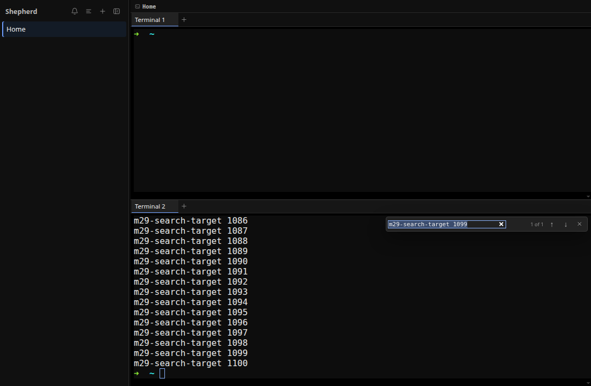
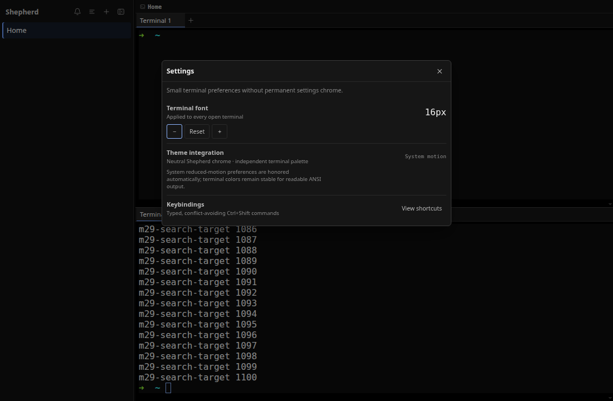

# M29 — Terminal Utilities and Contextual Help

## Goal

M29 replaces the old permanent shortcut furniture with tools that appear only when
they are useful: find for the active terminal, a typed command palette, contextual
shortcut help, and a small settings entry. The terminal remains the dominant surface.

## What changed

The renderer gained these focused modules:

```text
src/renderer/src/
├── commands.ts
├── commands.test.ts
├── terminalFind.ts
├── terminalFind.test.ts
└── components/
    ├── CommandPalette.tsx
    ├── DialogFrame.tsx
    ├── SettingsDialog.tsx
    └── ShortcutHelp.tsx
```

`App.tsx`, `TerminalHost.tsx`, `Sidebar.tsx`, `Icon.tsx`, `events.ts`, and
`App.css` connect those modules to the existing workspace, pane, terminal,
notification, and font-setting behavior. The official `@xterm/addon-search`
package provides scrollback search.

## One typed command registry

`commands.ts` is the source of truth for every discoverable action. `AppCommandId`
is a closed union, and each `AppCommand` supplies its title, category, optional
shortcut, search keywords, and optional availability rule.

The same `APP_COMMANDS` array drives three paths:

```text
Ctrl+Shift key event ─┐
command-palette row ──┼─> AppCommandId ─> App.executeCommandRef ─> existing action
shortcut-help row ────┘
```

This prevents the displayed shortcut, palette action, and global key handler from
drifting apart. `commandIdForShortcut()` accepts only exact Ctrl+Shift combinations
without Alt or Meta. Plain `Ctrl+F`, `Ctrl+C`, and other terminal control keys still
reach the PTY.

`commandContext()` derives live counts from `AppState`: workspaces, panes, terminals,
and unresolved unread notifications. `commandEnabled()` uses that context to prevent
closing the last workspace or pane and to disable unread navigation when there is no
unread work. Disabled commands remain visible in the palette with an unavailable label,
which explains the state instead of making the command mysteriously disappear.

`rankCommands()` normalizes at most eight query words, scores title prefixes ahead of
category and keyword matches, puts enabled results first, preserves registry order as
the stable tie-breaker, and returns at most 20 rows. `CommandPalette.tsx` derives the
ranked list with `useMemo`; it does not copy results into another state variable.

## Command execution in `App.tsx`

`executeCommandRef` maps every command ID to existing reducer actions or renderer
events. It creates and closes surfaces, splits and closes panes, creates and navigates
workspaces, toggles the sidebar, navigates notifications, changes font size, and opens
the three utility surfaces.

The global key listener is installed once. `stateRef`, `collapsedRef`, and
`utilityOverlayRef` give it current state without reinstalling the listener after every
render. The exhaustive `switch` makes TypeScript report a missing executor when a new
command ID is added.

Only one of `palette`, `help`, or `settings` can be open. Ordinary commands close the
utility overlay before acting. Find dispatches a surface-targeted custom event on the
next event-loop turn so the dialog can unmount before the terminal search input takes
focus.

## Find in the active terminal

Each `TerminalHost` owns one `SearchAddon` beside its existing fit, web-links, and
WebGL addons. It subscribes to `RENDERER_EVENT.terminalFind` and opens only when the
event's `surfaceId` matches that terminal. Switching away from the surface closes find
and clears its decorations.

`terminalFind.ts` defines the safety and presentation boundary:

- queries are limited to 512 printable characters;
- the search add-on highlights at most 1,000 matches;
- an empty query clears decorations and says `Enter search text`;
- zero matches say `No results`;
- bounded large searches say `1000+ results`;
- ordinary results announce the active position, such as `2 of 5`.

The xterm search add-on renders matches through xterm's decoration API. xterm 6 guards
that API behind `allowProposedApi`, so `TERMINAL_FIND_TERMINAL_OPTIONS` enables it only
at the terminal construction boundary. The live test initially exposed the missing
flag: output existed in the buffer, but decoration registration threw before the result
event could update the UI. The option and its regression assertion now document this
required compatibility contract.

The compact `role="search"` form sits inside the active pane. Typing performs
incremental next-search, Enter advances, Shift+Enter moves backward, and Escape clears
decorations, closes the form, and restores xterm focus. The result `<output>` is a
polite live region.



## Palette and contextual help

`CommandPalette.tsx` uses the combobox/listbox pattern:

- the query input owns `aria-controls` and `aria-activedescendant`;
- each result is an option with selected and disabled state;
- ArrowUp/ArrowDown wrap, Home/End jump, and Enter executes;
- the active option scrolls into view;
- a no-results message replaces the list when needed.

The palette is reachable from Ctrl+Shift+P and the small sidebar command icon. Search
and execution remain keyboard-first, but every option is also clickable.

`ShortcutHelp.tsx` filters the same registry through current availability. It therefore
shows only shortcuts that make sense for the current workspace. Its copy explicitly
states that terminal Ctrl keys remain untouched, and it links back to the palette.


## Shared dialog behavior

`DialogFrame.tsx` supplies the modal semantics, neutral shell, close action, Escape
handling, Tab/Shift+Tab focus loop, initial focus, and focus restoration used by the
palette, help, and settings.

Dialog-to-dialog transitions need special handling. If settings opens help, the
settings control being clicked is removed from the DOM. Restoring to that detached
element would leave focus on the document body. The module therefore retains one
`utilityFocusOrigin` across the whole transition chain, skips restoration while another
utility dialog exists, and restores the connected original element only after the last
dialog closes.

## Minimal settings entry

`SettingsDialog.tsx` deliberately reuses settled behavior rather than introducing a
second configuration system. The terminal font stepper calls `bumpFontSize()` and
`resetFontSize()`. Those functions clamp the value, persist it under
`shepherd.fontSize`, and broadcast the existing font-size event so every mounted xterm
updates and refits immediately.

The remaining sections explain the current contracts instead of pretending deeper
configuration exists: neutral application chrome, an independent ANSI-safe terminal
palette, automatic reduced-motion handling, and typed Ctrl+Shift keybindings. The
keybinding section opens contextual help.



## Styling and responsive behavior

`App.css` uses existing semantic tokens. Utility dialogs have one restrained border and
shadow, compact rows, no decorative gradients, and selection color only for the active
command. The terminal find form is anchored inside its pane instead of covering the
whole application.

At 520 pixels and below the dialog stretches to the available width and remains within
the viewport. At 620 pixels and below find hides only the result counter; its input and
navigation controls stay available.

## Tests and live proof

`commands.test.ts` covers unique IDs and shortcuts, ranking, keyword search, contextual
availability, shifted punctuation, and rejection of ordinary or conflicting terminal
key combinations. `terminalFind.test.ts` covers empty, missing, normal, and capped
result labels; control-character removal; the query bound; and the xterm proposed-API
compatibility setting. Both are part of `npm test`.

The isolated Electron run exercised 1,100 scrollback matches, empty and exact search,
next/previous movement, every focus return, palette ranking, palette-to-help and
settings-to-help transitions, live persisted font changes, a 520×560 emulated viewport,
ARIA roles, and the absence of a plain Ctrl+F shortcut conflict. It finished with:

```text
terminal find: 1000+ / empty / 1 of 1 / focus restored
palette: ranked, accessible, narrow-safe, focus restored
help: 14 contextual rows, no Ctrl+F conflict, transition focus retained
settings: font changed from 15px to 16px and persisted as 16
```

## Intentionally deferred

- Repo-defined `shepherd.json` palette actions are still deferred.
- Shell selection and editable keybinding remapping are not presented as implemented.
- Theme import and terminal color editing remain deferred; M26's stable terminal palette
  stays authoritative.
- Search is current-terminal only; cross-workspace output indexing would add a separate
  storage and privacy boundary.

## Checkpoint

1. Why must the palette, help view, and key listener share one command registry?
2. Why does find target an exact surface ID instead of whichever terminal mounts first?
3. Why is `allowProposedApi` required for highlighted SearchAddon results in xterm 6?
4. How does dialog focus survive settings-to-help and help-to-palette transitions?
5. Why does the settings dialog describe unsupported controls instead of rendering them?
