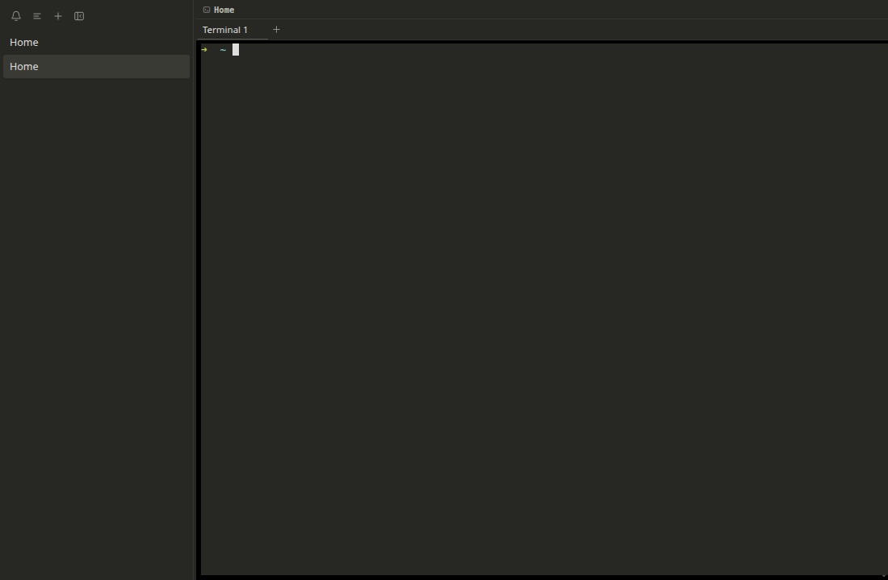

# M31 — cmux Terminal-Derived Theme

## Goal

M31 makes Shepherd's default composition follow the visual rule used by cmux:
the terminal background is the window's anchor, and permanent chrome blends into
that same field. The change fixes the previous near-black terminal rectangle
inside a separately tinted sidebar and tab shell.

The implementation is presentation-only. It does not change workspace state,
layout geometry, PTY ownership, IPC, terminal links, previews, or persistence.

## What the cmux research established

The current cmux source keeps terminal appearance in Ghostty configuration and
passes the resolved terminal background into its window appearance model. Its
sidebar can share the terminal root backdrop or add a material plus a bounded
black tint. cmux separately defines a cyan-blue accent and lets users override
the workspace selection color.

The official product screenshot was measured because it is the concrete visual
target. Its dominant terminal/sidebar/tab backdrop is `#272823`, common primary
chrome text is `#bdbfb4`, subtle dividers include `#363731`, and the selected
workspace is `#3f8ff7`. Shepherd adopts the backdrop system but intentionally
uses neutral interaction colors for its accepted default.

This explains why changing isolated colors did not achieve parity: cmux's quality
comes from shared backdrop ownership and a small number of deliberate contrast
events.

## File-by-file implementation

### `src/renderer/src/App.css`

The shell's permanent surface roles now resolve to the measured terminal
backdrop:

```text
canvas = sidebar = permanent surface = #272823
hover                                  = #2f302b
raised transient surface                = #34352f
border / strong border                  = #363731 / #52534f
```

Text roles use the screenshot's warm gray ladder. Selection, hover, focus,
informational metadata, Git metadata, and active-tab indication also stay within
that neutral ladder. Bounded attention uses amber rather than blue.

The active workspace uses one graphite selection block. Its old additional left
rail was redundant, so it was removed. Metadata and row actions receive a
selection-aware foreground, and an unread badge inverts against the block.

Active surface tabs remain transparent on the shared backdrop and use only a
one-pixel neutral edge. The previous raised active-tab slab created an extra card
inside otherwise flat terminal chrome.

### `src/renderer/src/terminalTheme.ts`

The frozen xterm theme now anchors the same composition with `#272823`, measured
foreground `#bdbfb4`, neutral cursor `#dededd`, and graphite selection.
It also defines the complete ANSI palette from cmux's bundled Ghostty default dark
theme instead of inheriting xterm's unrelated defaults.

The CSS and TypeScript values are deliberately coordinated defaults, not runtime
coupling. xterm still receives a frozen `ITheme`; renderer components still
consume semantic CSS roles. A later validated theme loader can update both
contracts through an explicit adapter.

### `src/main/index.ts`

The BrowserWindow paint color is now `#272823`. This prevents an almost-black
flash before React and xterm paint and keeps startup visually continuous.

### Regression tests

`themeTokens.test.ts` now verifies the shared backdrop, absence of blue cast in
every Shepherd-owned interaction role, selection foreground, flat active
workspace, and transparent active tab with one neutral edge. It retains
low-chroma surface and contrast checks.

`terminalTheme.test.ts` verifies the terminal backdrop, foreground, cursor,
selection, representative ANSI colors, immutability, and independence from CSS
variable strings.

## Live acceptance proof

The isolated Electron/Xvfb/CDP run measured:

- canvas, sidebar, and permanent surface tokens at `#272823`;
- workspace selection at `#393a34` and neutral accent/focus at `#bdbfb4`;
- no selected-workspace rail;
- a transparent active tab with one `#52534f` inset edge; and
- two live workspaces with no duplicate sidebar product label.



## Final no-blue acceptance correction

The first M31 pass copied the official screenshot's blue selection. Final visual
acceptance required no blue hint in Shepherd-owned UI. The settled mapping keeps
cmux's measured shared backdrop and density while using graphite selection,
neutral focus and tab edges, amber attention, neutral information/Git metadata,
and neutral xterm selection.

ANSI blue and cyan remain in the terminal palette because they are requested by
shells and terminal programs as content. They are not used by Shepherd chrome or
interaction state.

## Boundaries and future extension

M31 ships one fixed dark default. It does not parse a user's Ghostty config or
introduce arbitrary CSS loading. A future theme feature should parse a bounded
color schema, resolve readable text/selection pairs, and atomically produce both
the CSS role map and xterm `ITheme`.

## Checkpoint

1. Why does sharing one backdrop improve hierarchy more than adding more shades?
2. Why are the CSS and xterm defaults coordinated but still separate contracts?
3. Why does the selected workspace not also need a left rail?
4. What startup artifact does BrowserWindow's background color prevent?
5. What validation is required before accepting user-provided theme colors?
